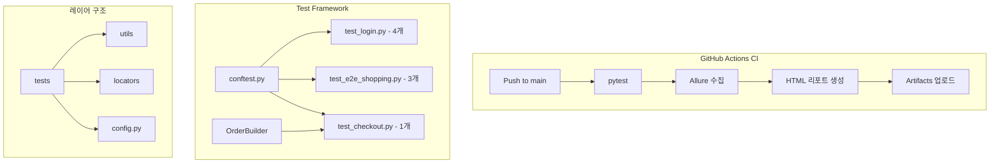
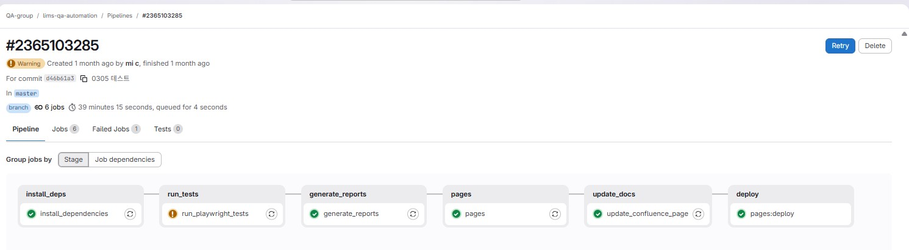
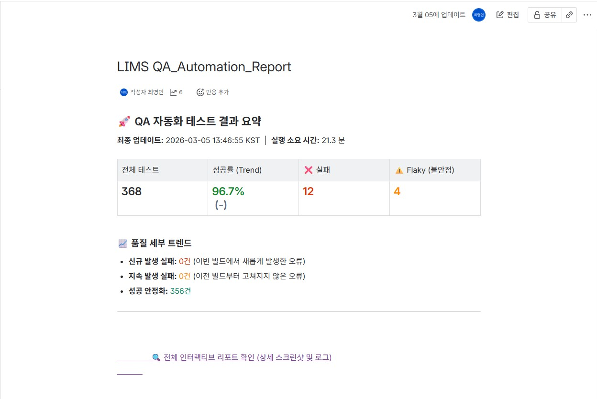
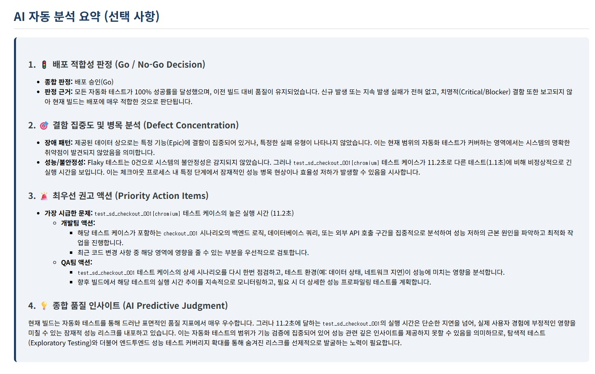
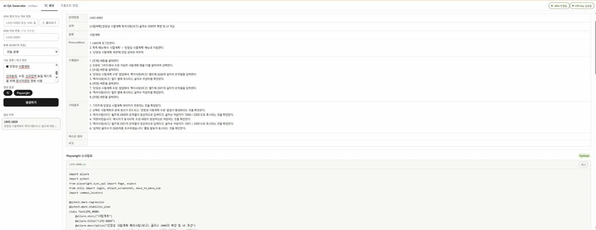

# playwright-e2e-framework


> Playwright E2E Test Automation Framework — SauceDemo

실무 LIMS 자동화 프로젝트의 아키텍처 패턴을 공개 데모 사이트(SauceDemo)에 재현한 포트폴리오입니다.

---

## 기술 스택

| 구분 | 도구 |
|------|------|
| Language | Python 3.13 |
| Framework | Playwright + pytest |
| Report | Allure + Custom HTML (Jinja2) |
| CI/CD | GitHub Actions |
| Target | [SauceDemo](https://www.saucedemo.com) |

---

## 프로젝트 구조

```
playwright-e2e-framework/
├── .github/workflows/
│   └── ci.yml                  # GitHub Actions CI
├── docs/images/                # 실무 적용 스크린샷
├── locators/                   # 페이지별 셀렉터 관리
│   ├── common.py               # 공통 셀렉터 (URL, 헤더 등)
│   └── auth.py                 # 인증 관련 셀렉터
├── tests/                      # 테스트 파일
│   ├── test_login.py           # 로그인 TC (4개)
│   ├── test_e2e_shopping.py    # E2E 전체 플로우 (3개)
│   └── test_checkout.py        # 결제 TC - data_builder 활용 (1개)
├── utils/                      # 공통 유틸리티
│   ├── utils.py                # login, attach_screenshot
│   └── shopping_order.py       # OrderBuilder (data_builder 패턴)
├── reporting/                  # 리포트 생성
│   ├── generate_report.py      # Allure JSON 파싱 + Jinja2 HTML 렌더링
│   └── report_template.html    # 커스텀 HTML 리포트 템플릿
├── config.py                   # 계정 정보 관리
├── conftest.py                 # pytest fixture 정의
└── requirements.txt            # 패키지 의존성
```

---

## 아키텍처 다이어그램



---

## 아키텍처 설계 의도

### 1. Locator 분리 관리
셀렉터를 테스트 코드와 분리하여 UI 변경 시 locator 파일만 수정하면 되는 구조입니다.
`data-test` 속성을 우선 활용하여 스타일/기능 변경에 영향받지 않는 안정적인 셀렉터를 사용합니다.

### 2. Fixture Scope 전략
테스트 목적에 따라 function / session scope를 의도적으로 분리하여 사용합니다. Scope 선택은 "테스트 격리"와 "실행 효율"의 트레이드오프이며, 시나리오 성격에 맞춰 판단합니다.

| Fixture | Scope | 사용 시나리오 | 선택 이유 |
|---------|-------|-------------|---------|
| `login_page` | function | 로그인 TC (`test_login.py`) | 각 TC가 로그인 전 상태에서 독립 시작해야 하므로 격리 우선 |
| `page` | function | 단일 기능 TC (`test_checkout.py`) | 로그인 상태는 공유하되, 테스트 간 상태 오염 방지. 사전 조건은 ShoppingOrder로 독립 세팅 |
| `e2e_page` | session | 연속 플로우 TC (`test_e2e_shopping.py`) | 상품 선택 → 장바구니 → 결제로 이어지는 연속 흐름을 단일 세션에서 검증. 실제 사용자의 단일 세션 경험 시뮬레이션 |

**설계 의도**: 실무에서는 "독립된 기능 단위 검증"과 "연속된 사용자 프로세스 검증" 두 가지가 모두 필요합니다. 전자는 function scope + ShoppingOrder 패턴으로, 후자는 session scope로 대응합니다.

**실무 적용**: LIMS 프로젝트에서도 동일한 전략을 사용합니다. 10단계 시험 워크플로우의 연속 프로세스 검증은 session scope로, 개별 단계(의뢰 검토, 결과 승인 등) 기능 검증은 function scope + exam_builder로 분리하여 운영하고 있습니다.

### 3. data_builder 패턴 (OrderBuilder)
특정 단계부터 테스트를 시작할 수 있도록 사전 상태를 자동으로 세팅하는 패턴입니다.
실무 LIMS 프로젝트의 10단계 시험 워크플로우 세팅 패턴을 동일한 구조로 재현했습니다.

```python
# 장바구니 담긴 상태부터 결제 TC 시작
builder = ShoppingOrder()
builder.setup_to_stage(page, ShoppingStage.PRODUCT_SELECTED)
```

`IntEnum`으로 단계를 정의하여 `>=` 비교로 순서대로 단계를 쌓는 구조입니다.

### 4. 커스텀 HTML 리포트 + AI 분석
Allure JSON 결과를 파싱하여 Jinja2 기반 커스텀 HTML 리포트를 생성합니다.
Pass Rate, 실행 시간, Epic별 품질 지표, 트렌드 차트를 포함하며 Gemini API를 활용한 배포 Go/No-Go 자동 판정 기능을 제공합니다.

---

## 테스트 커버리지

### 워크플로우 (6단계)
```
Login → Product → Cart → Checkout Info → Checkout Complete → Logout
```

### 시나리오

**test_login.py**
| TC | 시나리오 |
|----|---------|
| SD-LOGIN-001 | 정상 로그인 및 상품 목록 페이지 진입 확인 |
| SD-LOGIN-002 | ID 미입력 시 오류 메시지 노출 확인 |
| SD-LOGIN-003 | PW 미입력 시 오류 메시지 노출 확인 |
| SD-LOGIN-004 | PW 오류 시 오류 메시지 노출 확인 |

**test_e2e_shopping.py**
| TC | 시나리오 |
|----|---------|
| SD-E2E-001 | 상품 선택 및 장바구니 뱃지 확인 |
| SD-E2E-002 | 장바구니 진입 및 상품 노출 확인 |
| SD-E2E-003 | 결제 정보 입력 및 주문 완료 확인 |

**test_checkout.py**
| TC | 시나리오 |
|----|---------|
| SD-CHECKOUT-001 | data_builder로 장바구니 세팅 후 결제 완료 확인 |

---

## 실행 방법

```bash
# 1. 클론
git clone https://github.com/cmi94/playwright-e2e-framework.git
cd playwright-e2e-framework

# 2. 가상환경 생성 및 활성화
python -m venv venv
venv\Scripts\activate  # Windows

# 3. 패키지 설치
pip install -r requirements.txt

# 4. Playwright 브라우저 설치
playwright install

# 5. 테스트 실행
pytest tests/ --alluredir allure-results --json-report --json-report-file=test-results.json

# 6. 커스텀 HTML 리포트 생성
python reporting/generate_report.py

# 7. Allure 리포트 확인 (선택)
allure serve allure-results
```

---

## 실무 적용 사례

실무 LIMS 프로젝트에서 동일한 아키텍처 패턴을 적용하고 있습니다.

### 자동화 규모
- Playwright 기반 TC 358건, 커버리지 94%
- 10단계 시험 워크플로우 E2E 자동화 (의뢰 → 검토 → 승인 → 접수 → 지시 → 배정 → 채취 → 결과 → 검토 → 승인)
- 10개 고객사 환경을 JSON 기반 데이터 드리븐으로 대응
- pytest-xdist (workers=3) 병렬 실행으로 전체 회귀 테스트 시간 단축

### GitLab CI/CD 파이프라인
6단계 파이프라인으로 배포 전 자동 품질 검증을 수행합니다.

`install_deps → run_tests → generate_reports → pages → update_docs → deploy`



### Confluence 자동 갱신
테스트 완료 후 `update_confluence_page.py`가 실행되어 Pass Rate, 실행 시간, 트렌드 데이터가 Confluence 대시보드에 자동으로 누적됩니다.



### Gemini API 기반 배포 Go/No-Go 판정
커스텀 HTML 리포트 내에서 Gemini API를 호출하여 테스트 결과를 분석합니다. 신규 실패, 지속 실패, Flaky 패턴을 종합하여 배포 적합성을 자동으로 판정합니다.



### AI QA Code Generator
JIRA 티켓 번호를 입력하면 TC와 Playwright 스크립트를 자동으로 생성하는 도구를 직접 개발하여 실무에 적용했습니다.
- JIRA MCP 연동으로 티켓 내용 자동 파싱
- 사내 TC 작성 규칙 기반 프롬프트 설계
- TC + Playwright 스크립트 동시 생성



---

## Contact

- GitHub: [cmi94](https://github.com/cmi94)